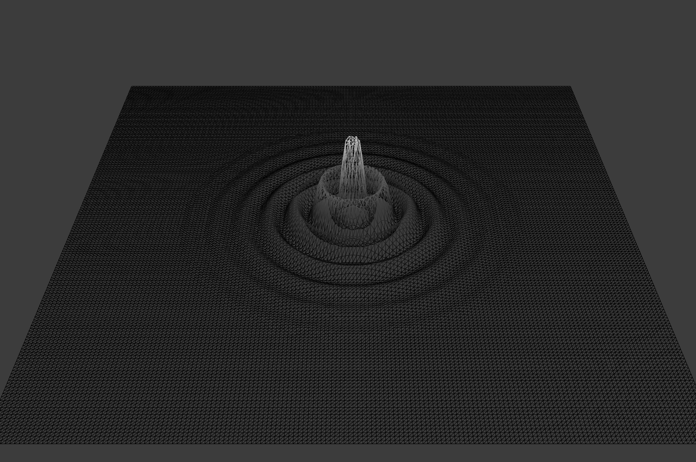

# Open Frameworks Sketches

# Samples

## Wireframe Conway's Game of Life
Uses OpenFrameworks OpenGL wrappers and some GLSL shader code to render a game of life simulation onto a 3D wireframe grid.

## Wireframe Ripple
Rough hacked together wave/ripple model displayed as a wireframe graphic:

