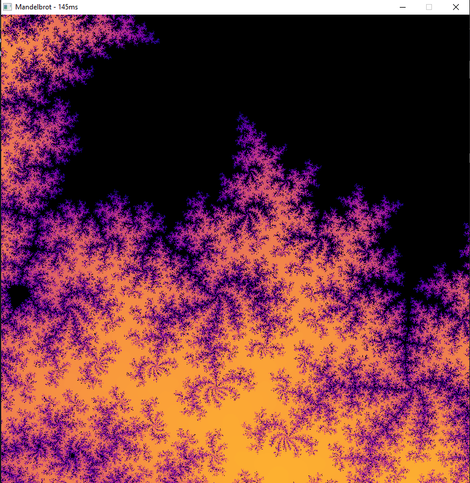

# Sketches

Some random code sketches that mess around with graphics, shaders, and other fun things.

# Samples
## Mandelbrot Set Fractal
Rust project using some OpenGL libraries and parallel processing to render fractals.

## Wireframe Conway's Game of Life
Uses OpenFrameworks OpenGL wrappers and some GLSL shader code to render a game of life simulation onto a 3D wireframe grid.

